<p align="center">
  
</p>

<h1 align="center">TikTok &amp; Douyin No-Watermark Downloader</h1>

<!-- 语言切换：置顶显眼，新手一眼可见 -->
<p align="center">
  <a href="README.md"></a>
</p>

<p align="center">
  
  
  
  
</p>

<p align="center">
  
</p>

A fast, cross-platform tool suite for downloading TikTok and Douyin videos and photo posts without watermarks. The project provides a **modern Windows desktop client**, a **native SwiftUI iOS app**, an **Android client**, an **experimental Docker WebUI for NAS**, and an **independent Linux/macOS CLI**.

Packaged desktop applications include the required runtime and browser components. The iOS client parses supported share pages and downloads media directly on the device without relying on a Python service or the Docker WebUI.

📝 **[Changelog](CHANGELOG.md)** — full release notes for every version.

---

## 🖼️ Screenshots

### 🖥️ Windows GUI

<div align="center">

| Main Window | Update Check |
| :-: | :-: |
|  | 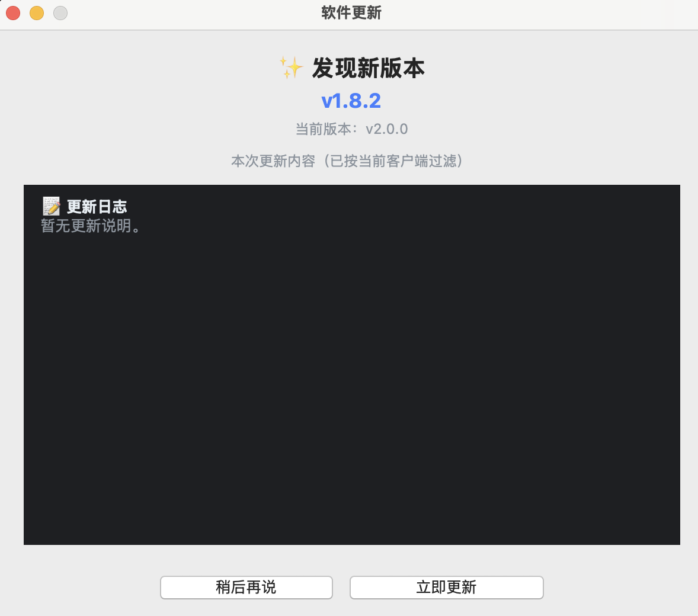 |

</div>

### 🍎 macOS App

<div align="center">

| Main Window | Menu Bar · Waiting for a Link | Menu Bar · Link Detected |
| :-: | :-: | :-: |
|  |  |  |

</div>

### 📱 iOS App

<div align="center">

| Select Video | Preview & Download | Downloaded Videos |
| :-: | :-: | :-: |
| 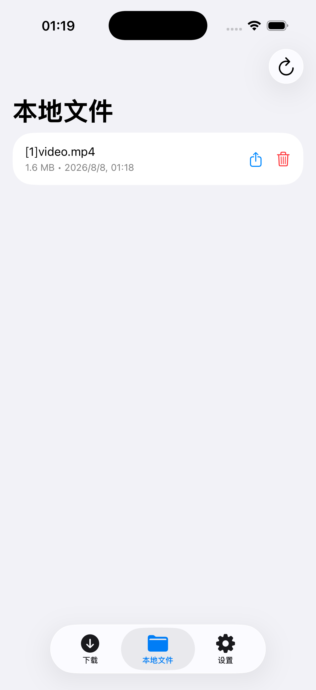 | 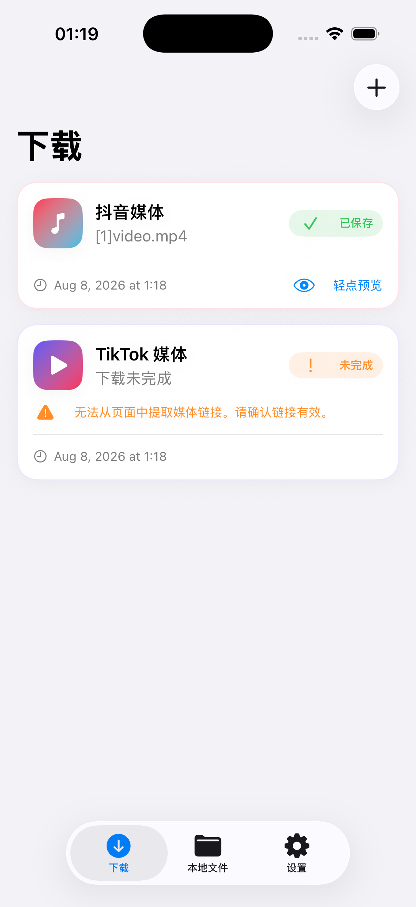 | 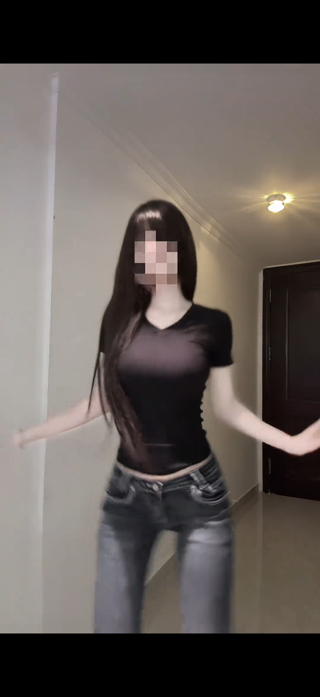 |
| Settings | Disclaimer | Using the Downloader |
| :-: | :-: | :-: |
| 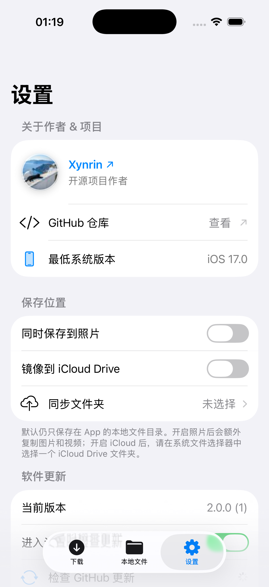 | 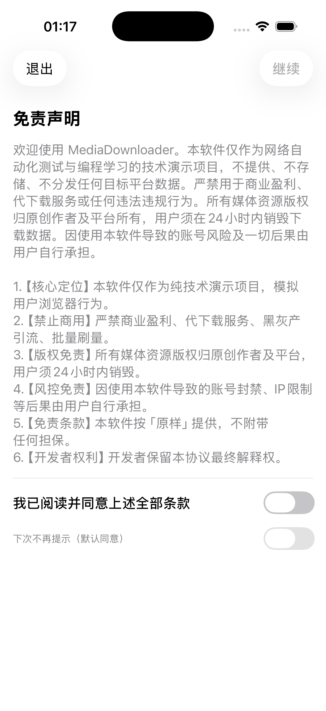 | 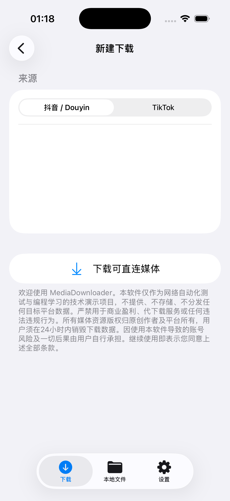 |

</div>

### 🐧 Linux CLI

<div align="center">

| Terminal |
| :-: |
| 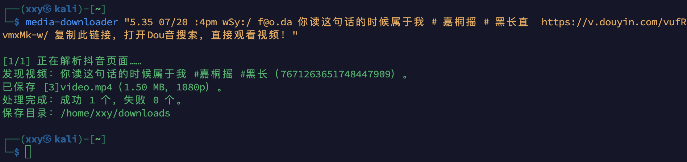 |

</div>

### 🤖 Android

<div align="center">

| Main | Settings |
| :-: | :-: |
| 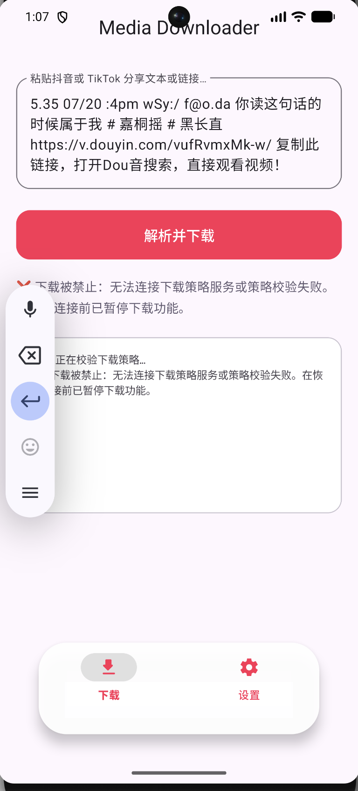 | 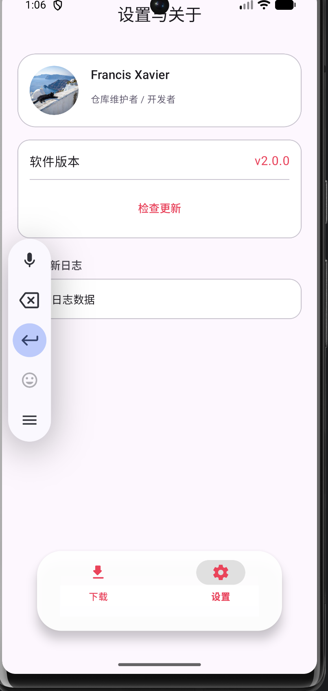 |

</div>

### 🐳 WebUI (experimental) · coming soon

<!-- 预留：截图就绪后放到 assets/webui-preview.png，替换下方占位行即可 -->
| Preview |
|:---:|
| _Coming soon in an upcoming release._ |

## ✨ Highlights

* 🎨 **Modern UI Design**: A minimalist Windows 11 Fluent-style dark interface with **seamless language switching (Chinese/English)**.
* 📱 **Native iOS App**: Parses supported Douyin/TikTok share links directly on the device, downloads no-watermark videos and photo posts, and manages local files through a native SwiftUI interface.
* ☁️ **Optional iOS Multi-Location Saving**: Keeps files locally in the app by default, with optional copies of supported media in Photos and a user-selected iCloud Drive folder.
* 📁 **Automatic Creator Archives**: Extracts creator names and automatically organizes downloaded videos and images into dedicated creator folders.
* 📦 **Standard Installer**: Provides a standard Windows `Setup.exe` with automatic installation, desktop shortcut creation, and a clean uninstaller.
* 🛡️ **Stealth Mode**: Uses anti-detection techniques to conceal WebDriver fingerprints and reduce the risk of triggering platform protections while downloading.

## 📥 Download & Install

### 💻 Windows / 🍎 macOS / 📱 iOS Users (GUI Recommended)

Visit the [Releases page](https://github.com/Francis-Xavier-code/tiktok-douyin-dl/releases) to download the latest installer:

- **Windows**: `MediaDownloader-Windows-x64-Setup-<ver>.exe`
- **macOS**: `MediaDownloader-macOS-<ver>.dmg` (ad-hoc signed; if Gatekeeper blocks the first launch, go to System Settings → Privacy & Security → Open Anyway)
- **iOS**: `MediaDownloader-iOS-<ver>-unsigned.ipa` (needs re-signing with your own Apple ID)

### 🤖 Android Users

Download `douyin-download-Android-<ver>.apk` from the [Releases page](https://github.com/Francis-Xavier-code/tiktok-douyin-dl/releases) and install it on your phone (allow installing from unknown sources).

### 🐍 Python CLI (PyPI)

Install the Python package from PyPI (works on Windows / Linux / macOS):

```bash
pip install tiktok-douyin-dl
python -m playwright install chromium
```

Then run `media-downloader`, `douyin-dl`, or `tiktok-dl`.

### 🐧 Linux / 🍎 macOS CLI Users

Run the following command in your terminal to download the latest CLI (Linux x86_64, macOS Apple Silicon arm64) and create symlinks in `~/.local/bin`:

```bash
curl -fsSL "https://raw.githubusercontent.com/Francis-Xavier-code/tiktok-douyin-dl/main/install.sh?v=$(date +%s)" | bash
```

### 🪟 Windows CLI Users

Run the following command in PowerShell to install the Windows CLI (adds `%LOCALAPPDATA%\MediaDownloader` to your user PATH, no admin needed):

```powershell
irm https://raw.githubusercontent.com/Francis-Xavier-code/tiktok-douyin-dl/main/install.ps1 | iex
```

Uninstall with:

```powershell
irm https://raw.githubusercontent.com/Francis-Xavier-code/tiktok-douyin-dl/main/uninstall.ps1 | iex
```

## 🤖 One-Sentence AI Prompt

Copy the sentence below, replace `<link>` with the Douyin/TikTok share link or result URL, and send it to any AI assistant — the AI reads the skill file itself, then downloads the work. **No installation or commands needed.**

```text
Read the Media Downloader skill at https://raw.githubusercontent.com/Francis-Xavier-code/tiktok-douyin-dl/main/skills/media-downloader/SKILL.md, then download this work using it: <link>
```

To search instead of pasting a link: `Read the skill at https://raw.githubusercontent.com/Francis-Xavier-code/tiktok-douyin-dl/main/skills/media-downloader/SKILL.md, find a public Douyin or TikTok video matching "<keywords>", show me the result, and download it.`

OpenClaw / AgentSkills users can install the skill instead: `openclaw skills install skills-sh:Francis-Xavier-code/tiktok-douyin-dl/media-downloader` and then use `$media-downloader`.

---

## 🚀 Usage

### Windows GUI

Open **MediaDownloader** from the desktop, paste the share text or link copied from Douyin/TikTok, select the corresponding platform, and click "Start Download."

### iOS App

Paste Douyin/TikTok share text or a link into the download screen and start the task. Completed media is stored only in the app's local files directory by default. Optional Photos or iCloud Drive copies can be enabled in Settings.

### CLI (Linux, macOS or Windows CMD)

```bash
media-downloader "Share text or link" [output_directory]
```

Windows/macOS CLI zips and the Linux tar.gz are attached to every [Release](https://github.com/Francis-Xavier-code/tiktok-douyin-dl/releases)
(the macOS CLI ships Apple Silicon arm64 builds). All CLI archives bundle the Playwright headless
Chromium as a sidecar (`ms-playwright/`), so no browser download is needed on first run. If macOS reports
an unidentified developer on first run, remove the quarantine attribute once:

```bash
xattr -d com.apple.quarantine $(which media-downloader)
```

The CLI automatically detects Douyin or TikTok from the link domain. Douyin search-result URLs containing `modal_id` are converted to direct work URLs automatically, so mobile share text is not required. Use `--platform douyin` or `--platform tiktok` only when a manual override is needed.

### Update changelog

Every client (Windows GUI, macOS/iOS apps, Android, CLI) checks for updates and shows a **per-platform changelog** — only the entries relevant to that client (tagged `[Windows]` / `[macOS]` / `[iOS]` / `[Android]` / `[CLI]` / `[全平台]` in [CHANGELOG.md](CHANGELOG.md)). All clients read the same machine-readable [`changelog.json`](changelog.json), which is regenerated from CHANGELOG.md at each release, so a single long changelog file serves every platform.

## Project layout

Application shells live in `apps/`, the installable Python package in `python/`, shared Swift code in `apple/`, the autonomous-agent skill in `skills/`, and reproducible build entry points in `scripts/`. See [`docs/architecture.md`](docs/architecture.md) for details.

Build both unsigned Apple artifacts at version `2.0.1` with `./scripts/build-apple.sh all`. Use `ios` or `macos` instead of `all` to build one platform.

## ⚖️ Disclaimer

This software is intended solely for personal study, academic exchange, and technical testing of webpage backups. Commercial use, illegal scraping, and cyberattacks are strictly prohibited. Users assume full responsibility for any copyright disputes or account restrictions resulting from use of this software.

## ⭐ Star History

If this project helps you, please give it a ⭐ — it motivates us to keep improving. The chart below is self-hosted (regenerated weekly by CI), so it always renders:

<p align="center">
  
  
  
</p>

<div align="center">
  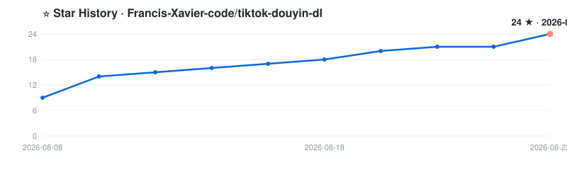
</div>
