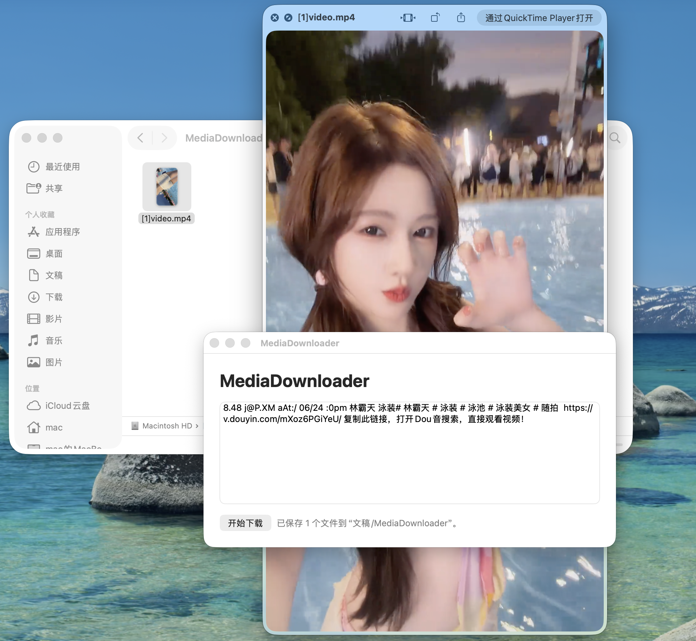
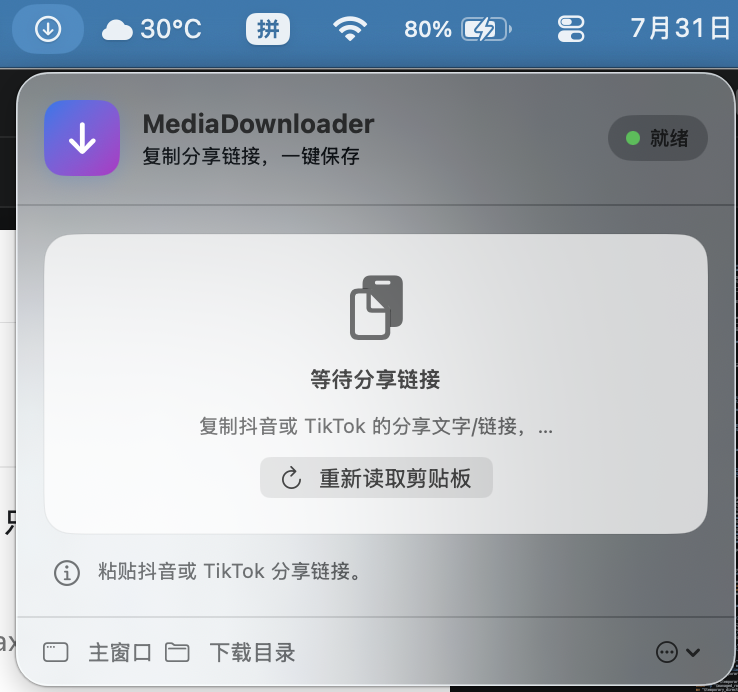
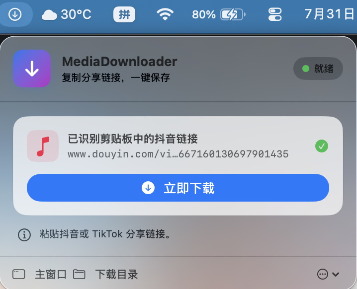
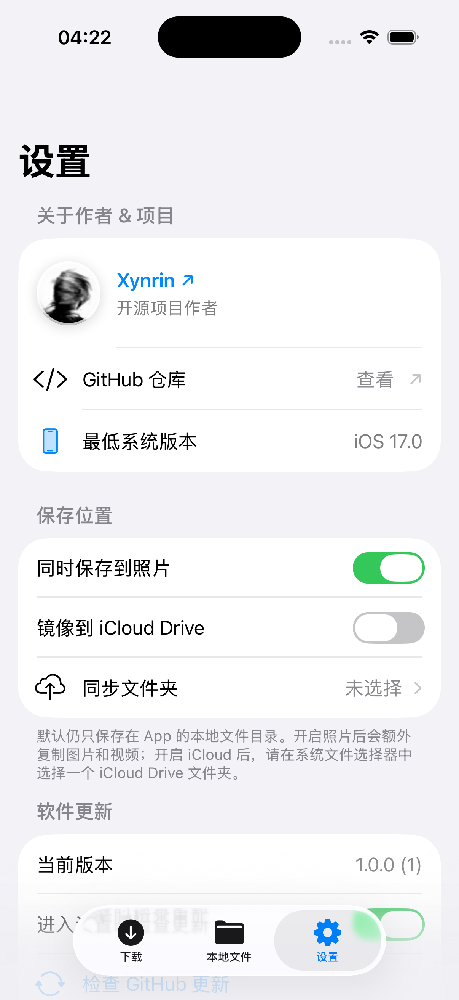
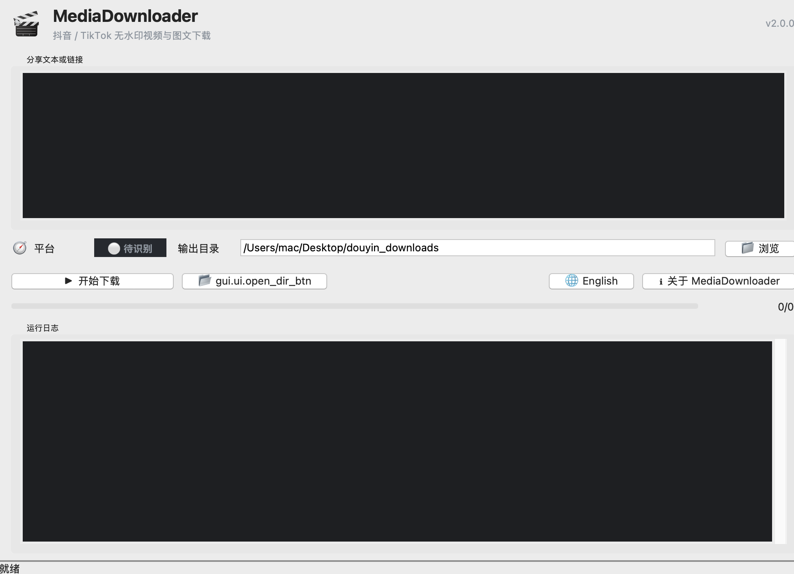
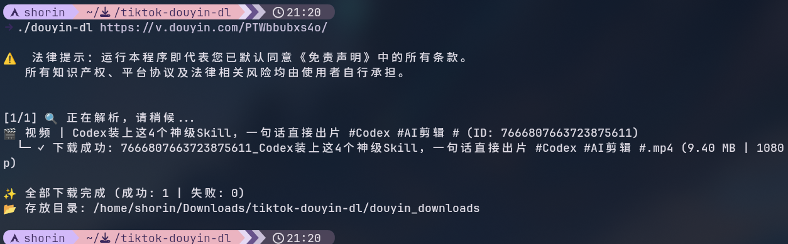
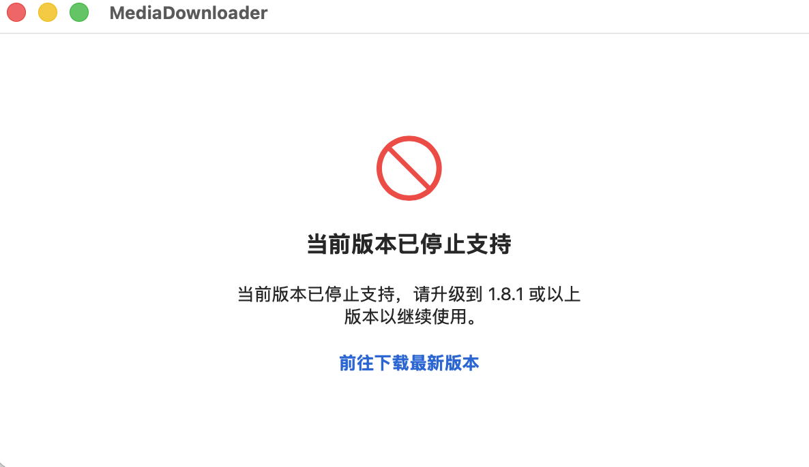

<p align="center">
  
</p>

<h1 align="center">TikTok &amp; Douyin No-Watermark Downloader</h1>

<p align="center">
  
  
  
  
  
  
</p>

A fast, cross-platform tool suite for downloading TikTok and Douyin videos and photo posts without watermarks. The project provides a **modern Windows desktop client**, a **native SwiftUI iOS app**, an **experimental Docker WebUI for NAS**, and an **independent Linux CLI**.

Packaged desktop applications include the required runtime and browser components. The iOS client parses supported share pages and downloads media directly on the device without relying on a Python service or the Docker WebUI.

📝 **[Changelog](CHANGELOG.md)** — full release notes for every version.

---

<a href="README.md"></a> <a href="README_zh.md"></a>

---

## 🖼️ Screenshots

<table width="100%">
  <tr>
    <th align="center">Native macOS App</th>
  </tr>
  <tr>
    <td align="center"></td>
  </tr>
</table>

<table width="100%">
  <tr>
    <th align="center" width="50%">Waiting for a Link</th>
    <th align="center" width="50%">Link Detected · One-Click Download</th>
  </tr>
  <tr>
    <td align="center"></td>
    <td align="center"></td>
  </tr>
</table>

<table width="100%">
  <tr>
    <th align="center" width="33%">New Download</th>
    <th align="center" width="33%">Local File Management</th>
    <th align="center" width="33%">Photos &amp; iCloud Settings</th>
  </tr>
  <tr>
    <td align="center"></td>
    <td align="center"></td>
    <td align="center"></td>
  </tr>
</table>

<table width="100%">
  <tr>
    <th align="center">Windows GUI</th>
  </tr>
  <tr>
    <td align="center"></td>
  </tr>
</table>

<table width="100%">
  <tr>
    <th align="center">Linux CLI</th>
  </tr>
  <tr>
    <td align="center"></td>
  </tr>
</table>

<table width="100%">
  <tr>
    <th align="center">Version Update Prompt</th>
  </tr>
  <tr>
    <td align="center"></td>
  </tr>
</table>

## ✨ Highlights

* 🎨 **Modern UI Design**: A minimalist Windows 11 Fluent-style dark interface with **seamless language switching (Chinese/English)**.
* 📱 **Native iOS App**: Parses supported Douyin/TikTok share links directly on the device, downloads no-watermark videos and photo posts, and manages local files through a native SwiftUI interface.
* ☁️ **Optional iOS Multi-Location Saving**: Keeps files locally in the app by default, with optional copies of supported media in Photos and a user-selected iCloud Drive folder.
* 📁 **Automatic Creator Archives**: Extracts creator names and automatically organizes downloaded videos and images into dedicated creator folders.
* 📦 **Standard Installer**: Provides a standard Windows `Setup.exe` with automatic installation, desktop shortcut creation, and a clean uninstaller.
* 🛡️ **Stealth Mode**: Uses anti-detection techniques to conceal WebDriver fingerprints and reduce the risk of triggering platform protections while downloading.

## 📥 Download & Install

### 💻 Windows/macOS/iOS Users (GUI Recommended)

Visit the [Releases page](https://github.com/Francis-Xavier-code/tiktok-douyin-dl/releases) to download the latest installer.

### 🍺 macOS Users (Homebrew)

```bash
brew tap Francis-Xavier-code/tap
brew install --cask tiktok-douyin-dl
```

The cask ships an ad-hoc signed build and removes the Gatekeeper quarantine attribute automatically, so the app opens without any approval prompt. See [docs/brew.md](docs/brew.md) for details.

### 🐧 Linux Users (CLI)

Run the following command in your terminal to download the latest binaries and create symlinks in `~/.local/bin`:

```bash
curl -fsSL "https://raw.githubusercontent.com/Francis-Xavier-code/tiktok-douyin-dl/main/install.sh?v=$(date +%s)" | bash
```

## 🤖 Autonomous AI Agent Skill

This repository includes an [AgentSkills-compatible Media Downloader skill](skills/media-downloader/SKILL.md) for OpenClaw and other autonomous AI agents.

Install it in an OpenClaw workspace:

```bash
openclaw skills install skills-sh:Francis-Xavier-code/tiktok-douyin-dl/media-downloader
```

Standard one-line agent prompt:

```text
Use $media-downloader to download this Douyin or TikTok result or share link: <URL>
```

Search-and-download prompt:

```text
Use $media-downloader to find a public Douyin or TikTok video matching "<keywords>", show me the selected result, and download it.
```

For agents without skill discovery: `Read skills/media-downloader/SKILL.md and use its bundled script to download this result or share link: <URL>`.

---

## 🚀 Usage

### Windows GUI

Open **MediaDownloader** from the desktop, paste the share text or link copied from Douyin/TikTok, select the corresponding platform, and click "Start Download."

### iOS App

Paste Douyin/TikTok share text or a link into the download screen and start the task. Completed media is stored only in the app's local files directory by default. Optional Photos or iCloud Drive copies can be enabled in Settings.

### CLI (Linux or Windows CMD)

```bash
media-downloader "Share text or link" [output_directory]
```

The CLI automatically detects Douyin or TikTok from the link domain. Douyin search-result URLs containing `modal_id` are converted to direct work URLs automatically, so mobile share text is not required. Use `--platform douyin` or `--platform tiktok` only when a manual override is needed.

## Project layout

Application shells live in `apps/`, the installable Python package in `python/`, shared Swift code in `apple/`, the autonomous-agent skill in `skills/`, and reproducible build entry points in `scripts/`. See [`docs/architecture.md`](docs/architecture.md) for details.

Build both unsigned Apple artifacts at version `1.8.0` with `./scripts/build-apple.sh all`. Use `ios` or `macos` instead of `all` to build one platform.

## ⚖️ Disclaimer

This software is intended solely for personal study, academic exchange, and technical testing of webpage backups. Commercial use, illegal scraping, and cyberattacks are strictly prohibited. Users assume full responsibility for any copyright disputes or account restrictions resulting from use of this software.

## Star History

<a href="https://www.star-history.com/?repos=Francis-Xavier-code%2Ftiktok-douyin-dl&type=date&legend=top-left">
 <picture>
   <source media="(prefers-color-scheme: dark)" srcset="https://api.star-history.com/chart?repos=Francis-Xavier-code/tiktok-douyin-dl&type=date&theme=dark&legend=top-left" />
   <source media="(prefers-color-scheme: light)" srcset="https://api.star-history.com/chart?repos=Francis-Xavier-code/tiktok-douyin-dl&type=date&legend=top-left" />
   
 </picture>
</a>
