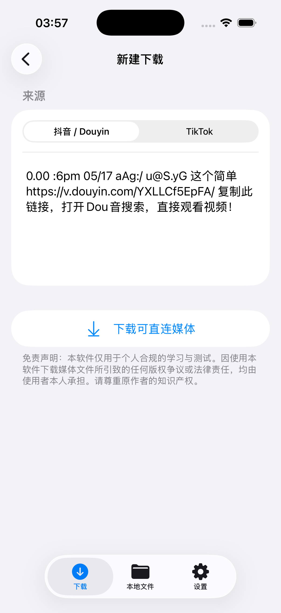
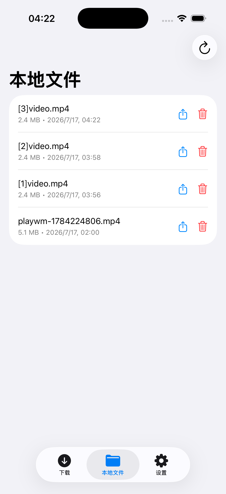
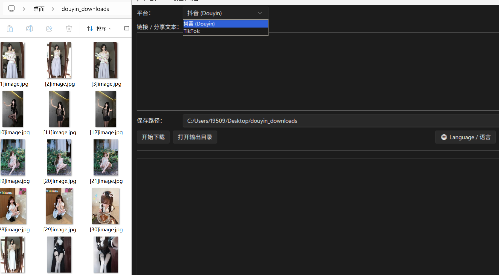

<p align="center">
  
</p>

<h1 align="center">🚀 TikTok &amp; Douyin Downloader</h1>
<p align="center"><strong>Windows · iOS · Docker · Linux</strong></p>

<p align="center">
    <a href="https://linux.do" alt="LINUX DO">
        </a>
</p>

<p align="center">
  <a href="https://github.com/Xynrin/tiktok-douyin-dl/releases/tag/v1.6.4"></a>
  <a href="https://github.com/Xynrin/tiktok-douyin-dl/releases/tag/ios-v1.0.2"></a>
  <a href="LICENSE"></a>
</p>


A cross-platform tool suite for downloading TikTok and Douyin videos and photo posts without watermarks. It includes a **modern Windows GUI**, a **native SwiftUI iOS app**, an **experimental Docker WebUI for NAS**, and an **independent Linux CLI**.

Packaged desktop binaries include their required runtime and browser components. The iOS client performs supported share-page parsing and media downloads directly on the device without requiring the Python service or Docker WebUI.

---

🌐 **[English]** | **[简体中文](README_zh.md)**

---

## 🖼️ Screenshots

<table width="100%">
  <tr>
    <th align="center" width="33%">New Download</th>
    <th align="center" width="33%">Local File Management</th>
    <th align="center" width="33%">Photos &amp; iCloud Settings</th>
  </tr>
  <tr>
    <td align="center"></td>
    <td align="center"></td>
    <td align="center"></td>
  </tr>
</table>

<table width="100%">
  <tr>
    <th align="center">Windows GUI</th>
  </tr>
  <tr>
    <td align="center"></td>
  </tr>
</table>

## ✨ Highlights

* 🎨 **Modern UI Design**: Windows 11 Fluent Design (Dark Mode) with a minimalist interface and **seamless language switching (EN/ZH)**.
* 📱 **Native iOS App**: Parses supported Douyin/TikTok share links on-device, downloads no-watermark videos and photo posts, and manages local files with a native SwiftUI interface.
* ☁️ **Optional iOS Copies**: Keep the default local copy, optionally save supported media to Photos, and mirror downloads to a user-selected iCloud Drive folder.
* 🧪 **Experimental Docker WebUI**: A reference deployment is available for NAS systems such as FeiNiu OS (fnos), but the current Docker setup has not yet been fully tested by the maintainers.
* 📁 **Smart Archive Management**: Automatically extracts the creator's username and groups downloaded videos and images into dedicated author folders.
* 🔄 **Silent Auto-Update**: Checks GitHub for updates on startup and performs seamless one-click background updates.
* 📦 **Standardized Installer**: Provides a standard Windows `Setup.exe` with desktop shortcuts and a robust uninstaller that leaves no trace.
* 🛡️ **Stealth Mode (Anti-Fingerprint)**: Uses advanced WebDriver evasion techniques to bypass platform bot detection and avoid IP bans.

## 📥 Download & Install

### 💻 Windows Users (GUI Recommended)
1. Open the [v1.6.4 desktop release](https://github.com/Xynrin/tiktok-douyin-dl/releases/tag/v1.6.4) (iOS releases use separate `ios-v*` tags).
2. Download `MediaDownloader_Setup.exe` and install it.
3. *Language Switch:* Click the "🌐 Language / 语言" button in the app to switch languages and restart instantly.
4. *Optional:* Download the standalone `douyin-dl.exe` or `tiktok-dl.exe` if you prefer the CLI.

### 📱 iOS Companion App

The native SwiftUI client lives in [`ios/MediaDownloader.xcodeproj`](ios/MediaDownloader.xcodeproj) and supports iOS 17 or later. It can:

- Parse supported Douyin and TikTok share links directly on the device.
- Download no-watermark videos and multi-image posts.
- Preview, share, and delete files stored under **Files > On My iPhone/iPad > MediaDownloader**.
- Optionally save supported media to Photos and mirror downloads to a selected iCloud Drive folder.
- Check stable `ios-v*` GitHub Releases for newer versions.

Download the current [`ios-v1.0.2` unsigned IPA](https://github.com/Xynrin/tiktok-douyin-dl/releases/tag/ios-v1.0.2), then sign it with your own Apple ID using Xcode, AltStore, Sideloadly, or another compatible signing tool. The in-app updater only detects a release and opens its download page; iOS does not allow this self-signed build to silently replace itself. See [`ios/README.md`](ios/README.md) for build, signing, and installation details.

### 🧪 NAS Users (Experimental Docker WebUI)

> **Untested:** The current Docker deployment has not yet been validated end to end by the maintainers. Treat the following Compose file as a reference, review it before use, and report any compatibility issues.

If you want to try it on a NAS such as FeiNiu OS, create a Custom App and adapt the following Docker Compose configuration to your paths and network:
```yaml
version: '3.8'
services:
  mediadownloader:
    build: https://github.com/Xynrin/tiktok-douyin-dl.git#main
    container_name: mediadownloader-webui
    restart: unless-stopped
    ports:
      - "7860:7860"
    volumes:
      - /vol1/downloads:/downloads   # Change the left side to your NAS download path
```
After deployment, try opening `http://<NAS_IP>:7860` in your browser. Availability may vary until the Docker setup has been fully tested.

### 🐧 Linux Users (CLI)
Run the following command in your terminal to automatically install the latest Linux binaries to `~/.local/bin`:

```bash
curl -fsSL "https://raw.githubusercontent.com/Xynrin/tiktok-douyin-dl/main/install.sh?v=$(date +%s)" | bash
```

---

## 🚀 Usage

### Windows GUI
Simply open **MediaDownloader** from your desktop, paste the share text/links, choose the platform (Douyin/TikTok), and click "Start Download".

### iOS App

Paste a Douyin/TikTok share text or link into the download screen and start the task. Completed media remains in the app's local Files directory by default; Photos and iCloud Drive copies are opt-in under Settings.

### CLI Usage (Linux & Windows CMD)
```bash
douyin-dl "Share text or link" [output_directory]
tiktok-dl "Share text or link" [output_directory]
```

## ⚖️ Disclaimer
By downloading or using this software, you agree that it is strictly for educational, academic, and web-testing purposes. Commercial use or illegal scraping is strictly prohibited. You are solely responsible for any copyright or legal disputes arising from its use.

## Star History

<a href="https://www.star-history.com/?repos=Xynrin%2Ftiktok-douyin-dl&type=date&legend=top-left">
 <picture>
   <source media="(prefers-color-scheme: dark)" srcset="https://api.star-history.com/chart?repos=Xynrin/tiktok-douyin-dl&type=date&theme=dark&legend=top-left" />
   <source media="(prefers-color-scheme: light)" srcset="https://api.star-history.com/chart?repos=Xynrin/tiktok-douyin-dl&type=date&legend=top-left" />
   
 </picture>
</a>
