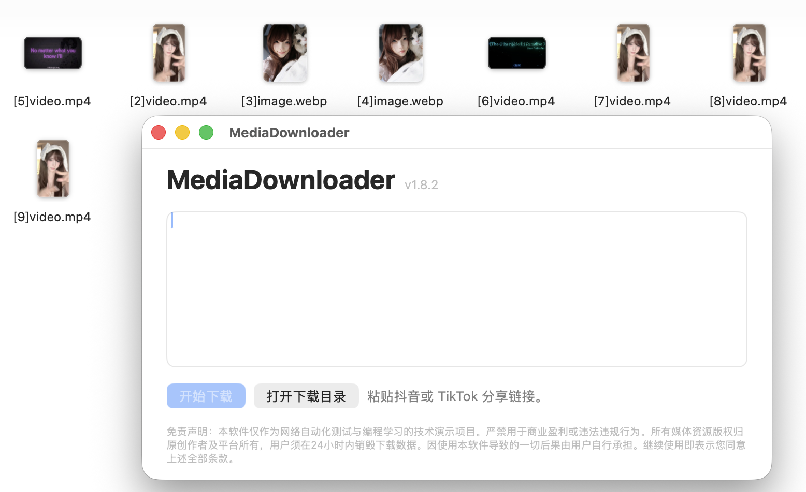

<p align="center">
  
</p>

<h1 align="center">TikTok &amp; 抖音无水印下载器</h1>

<p align="center">
  
  
  
  
  
  <a href="README.md"></a>
  <a href="README_zh.md"></a>
</p>

一款跨平台的高效工具套件，用于下载 TikTok 和抖音无水印视频及图文作品。项目提供 **现代化 Windows 桌面客户端**、**原生 SwiftUI iOS App**、适合 NAS 的 **实验性 Docker WebUI**，以及 **Linux 独立命令行工具**。

打包后的桌面程序已包含所需运行环境与浏览器组件；iOS 客户端可在设备本地解析支持的分享页面并下载媒体，不依赖 Python 服务或 Docker WebUI。

📝 **[更新日志](CHANGELOG.md)** —— 各版本完整变更记录。

---

---

## 🖼️ 界面预览

<table width="100%">
  <tr>
    <th align="center">原生 macOS App</th>
  </tr>
  <tr>
    <td align="center"></td>
  </tr>
</table>

<table width="100%">
  <tr>
    <th align="center" width="50%">等待分享链接</th>
    <th align="center" width="50%">识别链接 · 一键下载</th>
  </tr>
  <tr>
    <td align="center"></td>
    <td align="center"></td>
  </tr>
</table>

<table width="100%">
  <tr>
    <th align="center" width="33%">新建下载</th>
    <th align="center" width="33%">本地文件管理</th>
    <th align="center" width="33%">照片与 iCloud 设置</th>
  </tr>
  <tr>
    <td align="center"></td>
    <td align="center"></td>
    <td align="center"></td>
  </tr>
</table>

<table width="100%">
  <tr>
    <th align="center">Windows 图形界面</th>
  </tr>
  <tr>
    <td align="center"></td>
  </tr>
</table>

<table width="100%">
  <tr>
    <th align="center">Linux 命令行</th>
  </tr>
  <tr>
    <td align="center"></td>
  </tr>
</table>

<table width="100%">
  <tr>
    <th align="center">版本过低更新提示</th>
  </tr>
  <tr>
    <td align="center"></td>
  </tr>
</table>

## ✨ 功能亮点

* 🎨 **现代化 UI 设计**：全新引入 Windows 11 Fluent 风格的暗黑模式极简界面，并**新增了跨语言无缝切换 (中/英)**。
* 📱 **原生 iOS App**：直接在设备上解析支持的抖音/TikTok 分享链接，下载无水印视频和图文作品，并通过原生 SwiftUI 界面管理本地文件。
* ☁️ **可选的 iOS 多位置保存**：默认保留 App 本地文件；按需将支持的媒体额外保存到系统相册，并镜像到用户选择的 iCloud Drive 文件夹。
* 📁 **自动构建专属档案库**：下载内容不再杂乱无章！智能提取视频作者名，自动为你建立“作者专属文件夹”归档图文和视频。
* 📦 **规范化安装包**：提供标准的 Windows `Setup.exe`，包含自动安装、桌面快捷方式生成以及“不留痕迹”的暴力卸载。
* 🛡️ **终极风控伪装 (Stealth Mode)**：底层引入了最强防检测注入代码，隐匿 WebDriver 痕迹，最大程度防止下载时被官方风控。

## 📥 下载与安装

### 💻 Windows/Mac/ios 用户 (图形界面推荐)
前往[发布页面](https://github.com/Francis-Xavier-code/tiktok-douyin-dl/releases)下载最新的安装包

### 🍺 macOS 用户 (Homebrew)

```bash
brew tap Francis-Xavier-code/tap
brew install --cask tiktok-douyin-dl
```

该 cask 内置 ad-hoc 签名构建，安装时会自动清除 Gatekeeper 隔离属性，首次打开无需任何授权弹窗。发布说明见 [docs/brew.md](docs/brew.md)。

### 🐧 Linux 用户 (CLI 命令行)
在终端运行以下命令，即可自动拉取最新二进制包并软链接至 `~/.local/bin`：

```bash
curl -fsSL "https://raw.githubusercontent.com/Francis-Xavier-code/tiktok-douyin-dl/main/install.sh?v=$(date +%s)" | bash
```

## 🤖 自主 AI 代理 Skill

仓库内置了兼容 AgentSkills 标准的 [Media Downloader Skill](skills/media-downloader/SKILL.md)，可供 OpenClaw 等自主 AI 代理直接调用。

安装到 OpenClaw 工作区：

```bash
openclaw skills install skills-sh:Francis-Xavier-code/tiktok-douyin-dl/media-downloader
```

标准一句话提示词：

```text
请使用 $media-downloader 下载这个抖音或 TikTok 搜索结果或分享链接：<URL>
```

搜索并下载提示词：

```text
请使用 $media-downloader 搜索符合“<关键词>”的公开抖音或 TikTok 视频，告诉我选中了哪个结果，然后下载。
```

对于不支持自动发现 Skill 的代理，可直接说：`读取 skills/media-downloader/SKILL.md，并使用其完整脚本下载这个搜索结果或分享链接：<URL>`。

---

## 🚀 使用方法

### Windows 图形界面
双击桌面生成的 **MediaDownloader** 图标，在文本框内直接粘贴你在抖音/TikTok复制的“分享文本”或纯链接，选择对应平台，点击“开始下载”即可。

### iOS App

在下载页面粘贴抖音/TikTok 分享文本或链接并开始任务。下载完成后默认只保存在 App 的本地文件目录；如需相册或 iCloud Drive 副本，可前往设置页面手动开启。

### 命令行静默调用 (适用于 Linux 或 Windows CMD)
```bash
media-downloader "分享文本或链接" [保存目录]
```

CLI 会根据链接域名自动识别抖音或 TikTok；带 `modal_id` 的抖音搜索结果链接会自动转换为直接作品链接，不再要求必须提供手机分享文案。只有需要手动覆盖时才使用 `--platform douyin` 或 `--platform tiktok`。

## 项目结构

各平台应用位于 `apps/`，可安装的 Python 包位于 `python/`，Apple 共享 Swift 代码位于 `apple/`，自主 AI 代理 Skill 位于 `skills/`，构建入口位于 `scripts/`。详细说明见 [`docs/architecture.md`](docs/architecture.md)。

执行 `./scripts/build-apple.sh all` 可按 `1.8.0` 版本同时构建 iOS 与 macOS 无签名产物；将 `all` 改为 `ios` 或 `macos` 可单独构建。

## ⚖️ 免责声明
本软件仅限用于个人学习研究、学术交流及网页技术备份测试，严禁用于任何商业用途、非法抓取或网络攻击。因使用本软件导致的一切版权纠纷或账号风控后果，均由使用者自行承担全部责任。

## Star History

<a href="https://www.star-history.com/?repos=Francis-Xavier-code%2Ftiktok-douyin-dl&type=date&legend=top-left">
 <picture>
   <source media="(prefers-color-scheme: dark)" srcset="https://api.star-history.com/chart?repos=Francis-Xavier-code/tiktok-douyin-dl&type=date&theme=dark&legend=top-left" />
   <source media="(prefers-color-scheme: light)" srcset="https://api.star-history.com/chart?repos=Francis-Xavier-code/tiktok-douyin-dl&type=date&legend=top-left" />
   
 </picture>
</a>
